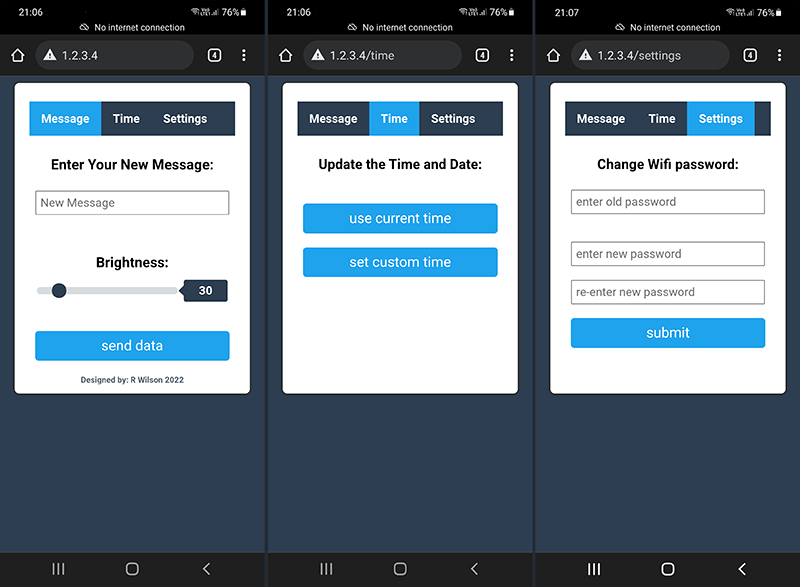

# ESP32 Message Board with NeoMatrix Display

[](https://platformio.org/)
[](https://www.espressif.com/)
[](https://opensource.org/licenses/MIT)
[](https://github.com/VostroDev/2022_ESP32MessageBoard_Neomatrix/releases)

<div align="center">
  
  <br>
  <em>Modern Web Interface for ESP32 Message Board</em>
</div>

## 📝 Description

A professional ESP32-based LED matrix display system featuring an elegant web interface for control and configuration. Perfect for information displays, clocks, and custom messaging systems. Built with modern async web server technology and supporting both 4-panel and 8-panel NeoMatrix configurations.

### ✨ Features

- 📱 **Modern Web Interface**
  - Intuitive touch-friendly design
  - Real-time control and configuration
  - Mobile-responsive layout
- 🎯 **Dynamic Display Features**
  - Real-time clock with RTC synchronization
  - Temperature monitoring and display
  - Auto-scrolling date and time
  - Customizable message support
  - Smooth text animations
- 🛠 **Technical Features**
  - Async web server with SPIFFS filesystem
  - OTA (Over-The-Air) updates
  - Adjustable LED brightness
  - Optional softRTC functionality (v5.0.1+)
  - Flexible 4 or 8 panel support
  - Hardware or software RTC options

## 🚀 Getting Started

### Quick Start Video
Watch our setup and demo video for a quick overview:

<div align="center">
  
  [](https://www.youtube.com/watch?v=KXobKjZ4cho "ESP32 Message Board Demo")
  
  <em>Click to watch the demo video</em>
</div>

### Installation Steps

1. **Clone the repository**
   ```bash
   git clone https://github.com/VostroDev/2022_ESP32MessageBoard_Neomatrix.git
   ```

2. **Open in VSCode with PlatformIO**
   - Install [Visual Studio Code](https://code.visualstudio.com/)
   - Install [PlatformIO Extension](https://platformio.org/install/ide?install=vscode)
   - Open project folder in VSCode
   - PlatformIO will automatically install required dependencies

3. **Configure Your Setup**
   - Update WiFi credentials in `data/config.json`
   - Choose 4-panel or 8-panel configuration in `config.h`
   - Upload filesystem image with web interface files
   ```bash
   pio run --target uploadfs
   ```

4. **Upload the Code**
   - Connect your ESP32
   - Click the PlatformIO upload button or run:
   ```bash
   pio run --target upload
   ```

[](https://www.youtube.com/watch?v=KXobKjZ4cho "Dot Matrix Clock")


## 🛠 Hardware Setup

### Required Components

| Component | Link | Description |
|-----------|------|-------------|
| ESP32 Dev Board | [Buy](https://www.adafruit.com/product/3405) | Main controller |
| DS3231 RTC Module | [Buy](https://www.adafruit.com/product/3013) | Real-time clock |
| NeoMatrix WS2812B | [Buy](https://www.adafruit.com/product/1487) | LED display panels |

### Wiring Guide

| ESP32 Pin | Component | Wire Color |
|-----------|-----------|------------|
| GPIO21 | RTC SDA | Gray/Orange |
| GPIO22 | RTC SCL | Purple/Yellow |
| GPIO5* | LED Data | White/Green |

\* GPIO pin configurable in code

### Display Configurations
- **4-Panel Setup**: 32x8 pixels (256 LEDs)
- **8-Panel Setup**: 64x16 pixels (1024 LEDs)
- Flexible PCB design available for clean installation

## 📦 Software Requirements

### Development Environment
- [Visual Studio Code](https://code.visualstudio.com/)
- [PlatformIO IDE Extension](https://platformio.org/)

### Required Libraries
| Library | Version | Purpose |
|---------|---------|----------|
| RTClib | ≥2.0.2 | RTC communication |
| ArduinoJson | ≥6.18.5 | JSON handling |
| FastLED | ≥3.4.0 | LED control |
| ESPAsyncWebServer | latest | Web server |
| AsyncElegantOTA | ≥2.2.5 | OTA updates |
| LEDMatrix* | included | Matrix control |
| LEDText* | included | Text rendering |

\* Custom libraries included in repository

## 📈 Version History

### Latest Release


| Version | Release Date | Highlights |
|---------|--------------|------------|
| 5.0.1 | Feb 23, 2024 | • Added softRTC option<br>• Stability improvements |
| 5.0.0 | 2024 | • 8-panel support (64x16)<br>• Flexible PCB version |
| 4.0.0 | 2023 | • 4-panel support<br>• Message validation |
| 2.0.1 | 2023 | • Enhanced web interface |
| 2.0.0 | 2023 | • AsyncWebserver implementation |
| 1.1.0 | 2022 | • Brightness control |
| 1.0.0 | 2022 | • Initial release |

[View all releases](https://github.com/VostroDev/2022_ESP32MessageBoard_Neomatrix/releases)

## 👥 Contributing

Contributions are welcome! Please feel free to submit a Pull Request. For major changes, please open an issue first to discuss what you would like to change.

## ✍️ Author

**R Wilson** - [VostroDev](https://github.com/VostroDev)
- Email: vostrodev@gmail.com
- Website: [vostro.dev](https://vostro.dev)

## 📝 License

This project is licensed under the MIT License - see the [LICENSE](LICENSE) file for details

## 🙏 Acknowledgments

Special thanks to the following projects and their maintainers:

- [Adafruit](https://www.adafruit.com/) - For NeoMatrix hardware and RTC library
- [Benoit Blanchon](https://arduinojson.org) - For ArduinoJson library
- [Daniel Garcia](https://fastled.io) - For FastLED library
- [A Liddiment](https://github.com/AaronLiddiment) - For LEDText and LEDMatrix libraries
- [me-no-dev](https://github.com/me-no-dev) - For AsyncTCP and ESPAsyncWebServer
- [Rui Santos](https://RandomNerdTutorials.com) - For ESP32 tutorials and insights

---
<div align="center">
Made by Wilteq.co.za
<br>
© 2022-2025
</div>
